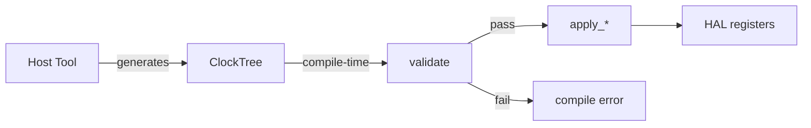

# ClockDomain Contract

This document defines the contract of
[`Inc/HALAL/Models/Clocks/ClockDomain.hpp`](../Inc/HALAL/Models/Clocks/ClockDomain.hpp).

## 1. Architecture

ClockDomain owns the entire clock configuration of the MCU.  The clock tree is a precomputed artifact produced by the host tool (or hand-written).  The firmware validates it at compile time and applies it at runtime.  There is no solver in the firmware.



- **Host tool**: takes peripheral requirements → produces a complete `ClockTree` with all PLL parameters, bus prescalers, and peripheral source assignments.
- **Firmware (`validate`)**: checks all PLL ranges, bus clock consistency, and every peripheral's `try_solve` against its assigned kernel clock.  Refuses to compile on failure.
- **Firmware (`apply_*`)**: writes the validated tree to HAL registers at runtime.

## 2. ClockTree

`ClockTree` stores **only decisions**.  Everything derivable from those decisions is computed via static accessor functions.

| Storage                                    | Accessor                                                |
| ------------------------------------------ | ------------------------------------------------------- |
| `pll1_m`, `pll1_n`, `pll1_p`, `pll1_fracn` | `pll1_vco(t)`, `pll1_input(t)`, `pll1_rge(t)`           |
| `pll1_q`, `pll1_r`                         | `source_frequency(t, PLL1Q)`                            |
| `d1cpre`, `d2ppre1`, `d2ppre2`             | `sysclk(t)`, `hclk(t)`, `pclk1/2(t)`, `timer_apb1/2(t)` |
| `spi123_src`, `spi45_src`, …               | `source_frequency(t, src)` → kernel clock               |
| `adc_src`, `fdcan_src`, `sdmmc_src`        | same                                                    |
| `pll2_m/n/p/q/r/fracn`                     | `pll2_vco(t)`, `pll2_rge(t)` + per-output frequencies   |
| `pll3_m/n/p/q/r/fracn`                     | same for PLL3                                           |

No peripheral reads a clock frequency from the tree directly — they call `ClockDomain::source_frequency(t, t.spi123_src)`, `ClockDomain::timer_apb1(t)`, etc.

## 3. Domain Contract

ClockDomain follows the standard ST-LIB domain contract defined in
[`st-lib-board-contract.md`](st-lib-board-contract.md).

### 3.1 Entry

```cpp
struct Entry {
    ClockGroup group;
    TrySolveFn try_solve;   // bool (*)(uint32_t kernel_clk)
};
```

Every `Entry` represents a peripheral that needs a kernel clock.  `try_solve` returns true if the
given kernel clock frequency can satisfy the peripheral's requirements (e.g. can a valid baudrate
be derived via prescaler).

`try_solve` is **mandatory** — no null pointers.  Every entry in ClockDomain is a real clock
requirement.

### 3.2 Device

Other domains use `ClockDomain::Device` to inscribe their clock requirements:

Example (SPI):

```cpp
using Model = SPIClockModel<SPI123_G, max_baudrate, min_baudrate>;
auto clock_device = ClockDomain::Device{
    .group = Model::group,
    .try_solve = &Model::try_solve,
};
clock_device.inscribe(ctx);
```

### 3.3 build() — Validation

```cpp
template <std::size_t N>
static consteval void build(
    std::span<const Entry, N> entries,
    const ClockTree& tree
);
```

Called by `Board::build()`.  Validates:
- All PLL parameters in range, inputs in range.
- `sysclk`/`hclk`/`pclk`/timers consistent and within chip maximums.
- `d1cpre` is a valid divider value.
- Every peripheral's `try_solve(get_kernel_clock(tree, group))` returns true.
- PLL2/PLL3 outputs are correctly configured when a source references them.

Failure calls `compile_error()` which aborts compilation.

Peripheral source-to-frequency consistency is guaranteed by construction (all frequencies are derived from the source via `source_frequency`).

### 3.4 Init — Runtime Application

```cpp
struct Init {
    static void init(const ClockTree& tree);
};
```

Writes the validated `ClockTree` to STM32 HAL registers:
- `apply_system_clocks(tree)` — configures PLL1, system clocks, flash latency, voltage scaling.
- `apply_peripheral_clocks(tree)` — configures all peripheral kernel clock muxes and enables PLL output lines.

Peripheral bus clock gates (`__HAL_RCC_*_CLK_ENABLE`) are handled by the respective peripheral domains — they're per-instance wiring, not clock architecture.

## 4. Clock Models

Peripheral domains define clock models that implement `try_solve`.  Models validate that a candidate kernel clock can satisfy the peripheral's requirements.

| Peripheral | Model                                    | Checks                                                              |
| ---------- | ---------------------------------------- | ------------------------------------------------------------------- |
| SPI        | `SPIClockModel<Group, MaxBaud, MinBaud>` | `∃ prescaler ∈ {2,4,…,256}: kernel/prescaler ∈ [MinBaud, MaxBaud]`  |
| ADC        | `ADCClockModel<MaxADCCLK>`               | `∃ prescaler ∈ {1,2,…,256}: kernel/prescaler ∈ [0.5MHz, MaxADCCLK]` |
| SDMMC      | `SDClockModel<MaxFreq, MinFreq>`         | `∃ CLKDIV ∈ [0,1023]: kernel/(2·CLKDIV) ∈ [MinFreq, MaxFreq]`       |

Models are instantiated in the peripheral's `inscribe()` via the device's configuration (baudrate, resolution, target frequency).

## 5. Board Integration

`Board<FaultPolicy, ClockTree, devices...>` takes the `ClockTree` as a mandatory second template parameter.  Users who don't have a host-tool-generated tree can use `default_clock_tree` (hardcoded for 8 MHz or 25 MHz HSE with 550 MHz SYSCLK).

```cpp
using Board = ST_LIB::Board<
    ST_LIB::DefaultFaultPolicy,
    my_clock_tree,  // or ST_LIB::default_clock_tree
    spi_device, led, timer
>;
```

`Board::build()` calls `ClockDomain::build(span, tree)` which runs `validate()`.

## 6. Adding a New Peripheral Clock Requirement

1. Define a model (like `SPIClockModel`) with `group`, `try_solve`, and any needed prescaler checking logic.
2. In the peripheral's `Device::inscribe`, call `ClockDomain::Device{...}.inscribe(ctx)` with the model's `group` and `try_solve`.
3. Add the new `ClockGroup` value to the `ClockGroup` enum.
4. Add the group → source mapping in `get_kernel_clock()`.
5. Add the source to the `ClockTree` struct and its mux case to `apply_peripheral_clocks()`.
6. Add any PLL output enable calls in `apply_peripheral_clocks()` if the source is a PLL output.
