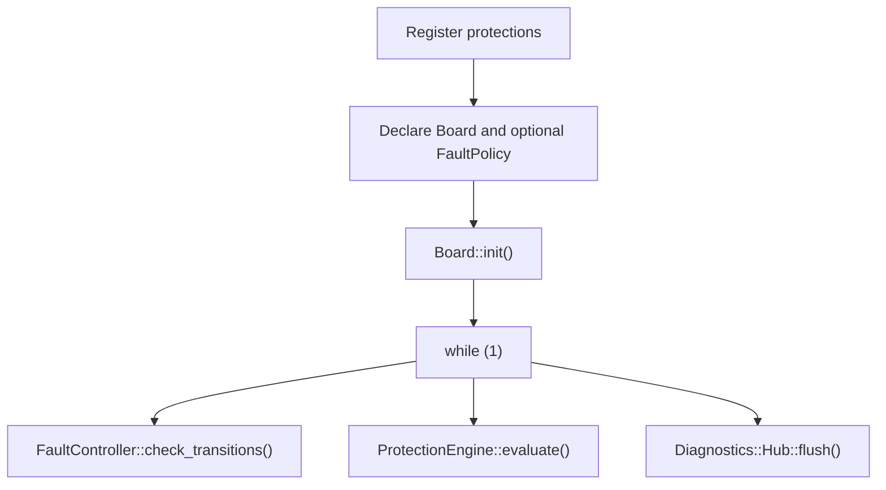
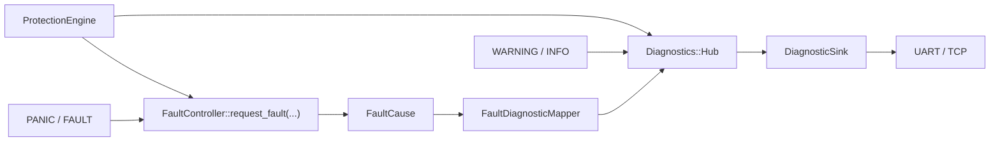

# Protections, Faults, and Diagnostics

This document describes the current protection, fault, diagnostic, and transmission model in
`ST-LIB`.

It is intentionally split into two parts:

- **How to use**
- **Internal development**

If you only want to integrate protections into an application, read the first part only.

## 1. How to Use

### 1.1 Mental Model

The subsystem has three explicit runtime operations:

- `Board::init()`
- `ProtectionEngine::evaluate()`
- `Diagnostics::Hub::flush()`

If the application uses an operational state machine nested under the global runtime, it also
polls:

- `FaultController::check_transitions()`

The global fault model is always the same:

- the framework owns a global runtime with two states: `OPERATIONAL` and `FAULT`
- internally, the only way to enter the global `FAULT` state is `FaultController::request_fault(...)`
- protection faults, `PANIC(...)`, and `FAULT(...)` all end up there
- fault diagnostics are transmitted with urgent priority through `Diagnostics`



### 1.2 Registering Protections

Protections are created through `ProtectionEngine::create_protection(...)`.

Each protection:

- has a stable name
- reads from one `SampleSource<T>`
- owns one or more rules

Rules are added through the factories in `Protections::Rules`.

Available rule factories:

- `Rules::below(...)`
- `Rules::above(...)`
- `Rules::range(...)`
- `Rules::equals(...)`
- `Rules::not_equals(...)`
- `Rules::time_accumulation(...)`

Both `create_protection(...)` and `add_rule(...)` return `std::expected`, so configuration errors
must be handled explicitly.

### 1.3 When to Register Protections

Register protections before `Board::init()`.

The intended lifecycle is:

1. registration
2. `Board::init()`
3. evaluation and flushing in the runtime loop

After `Board::init()`, the protection registry is locked.

### 1.4 Typical Protection Example

```cpp
#include "ST-LIB.hpp"

using namespace ST_LIB;

constexpr auto led = DigitalOutputDomain::DigitalOutput(PF13);
using MainBoard = Board<led>;

float bus_voltage = 0.0f;

int main() {
    auto protection = ProtectionEngine::create_protection(
        "bus_voltage",
        SampleSource<float>{bus_voltage}
    );

    if (!protection.has_value()) {
        PANIC("failed to register bus_voltage protection");
    }

    if (!protection->add_rule(Protections::Rules::below(350.0f, 370.0f)).has_value()) {
        PANIC("failed to add below rule");
    }

    if (!protection->add_rule(
             Protections::Rules::time_accumulation(20.0f, 15.0f, 0.5f, 10000.0f)
         )
             .has_value()) {
        PANIC("failed to add time_accumulation rule");
    }

    MainBoard::init();

    while (1) {
        ProtectionEngine::evaluate();
        Diagnostics::Hub::flush();
    }
}
```

### 1.5 Global Fault Runtime

`Board::init()` always installs and starts the global fault runtime.

That runtime has two states:

- `OPERATIONAL`
- `FAULT`

If the application does not use a functional state machine, nothing else is required.

If the application does use a functional state machine, it can be nested inside `OPERATIONAL`
through a `FaultPolicy`.

Example:

```cpp
enum class AppState : uint8_t { IDLE = 0, RUN = 1 };

static constexpr auto idle_state = make_state(AppState::IDLE);
static constexpr auto run_state = make_state(AppState::RUN);

static inline auto app_machine = make_state_machine(AppState::IDLE, idle_state, run_state);

static void on_fault_enter() {
    // disable power stage, set LEDs, open contactors, etc.
}

static inline constexpr FaultPolicy<app_machine, on_fault_enter> fault_policy{};
using MainBoard = Board<fault_policy, led>;

int main() {
    MainBoard::init();

    while (1) {
        FaultController::check_transitions();
        ProtectionEngine::evaluate();
        Diagnostics::Hub::flush();
    }
}
```

Important rules:

- the user state machine models operational behavior only
- the user does not program transitions to the global `FAULT`
- if a fatal condition must force the system into `FAULT`, user code should use `PANIC(...)` or
  `FAULT(...)`
- if a nested operational state machine is used, poll `FaultController::check_transitions()`, not
  the child machine directly

### 1.6 Runtime Diagnostics API

The runtime diagnostic façade is:

- `PANIC(...)`
- `FAULT(...)`
- `WARNING(...)`
- `INFO(...)`

Their semantics are:

- `PANIC(...)`: fatal runtime/internal error, enters the global `FAULT`
- `FAULT(...)`: fatal domain/application fault, enters the global `FAULT`
- `WARNING(...)`: non-fatal diagnostic
- `INFO(...)`: informational diagnostic

`PANIC(...)` and `FAULT(...)` both call the same global fault path underneath.
The difference is semantic classification of the cause and diagnostic category.

### 1.7 Internal Fault Primitive

Internally, protections and fatal runtime reporters converge on:

```cpp
FaultController::request_fault(cause);
```

This primitive is not intended to be the normal user-facing API.
User code should prefer `FAULT(...)` or `PANIC(...)` so the library captures consistent source
metadata and preserves the public runtime contract.

### 1.8 Transmission Semantics

All external reporting goes through `Diagnostics`.

There is no separate fault-broadcast subsystem anymore.

The transmission model is:

- normal diagnostics are queued with `NORMAL` priority
- faults are published with `URGENT` priority
- `Diagnostics::Hub::flush()` always drains urgent records first

Default sinks are installed during `Board::init()`:

- UART sink when UART printing is available
- TCP sink when `STLIB_ETH` is enabled

If a transport is not compiled in, it is simply not installed.

## 2. Internal Development

### 2.1 Architectural Overview

The design is split into four concerns:

- **protections**: evaluate domain rules over samples
- **faulting**: control the global `OPERATIONAL/FAULT` runtime
- **diagnostics**: store and dispatch structured records
- **transport**: serialize and emit diagnostics



The key boundaries are:

- protections do not know transport
- diagnostics do not own or evaluate protections
- `FaultController` does not own sinks
- transport does not change system state

### 2.2 Protection Domain Model

Public API:

- `ProtectionEngine::create_protection(...)`
- `ProtectionHandle<T>::add_rule(...)`
- `Protections::Rules::*`

Internal model:

- one flat collection of protections
- no low/high frequency split in the domain model
- rule configuration returned through `std::expected`
- rule evaluation produces `RuleState`, `RuleEdge`, and `RuleSnapshot`

Supported rule kinds:

- `BELOW`
- `ABOVE`
- `RANGE`
- `EQUALS`
- `NOT_EQUALS`
- `TIME_ACCUMULATION`

`ProtectionEngine::evaluate()`:

- walks every protection
- publishes non-fatal rule edges through `Diagnostics`
- requests the global fault when a rule reaches `FAULT`
- throttles repeated fault notifications with `notify_delay_in_microseconds`

### 2.3 Global Fault Runtime

`FaultController` owns the global runtime state machine.

The runtime machine is:

- always present
- always two-state: `OPERATIONAL` / `FAULT`
- optionally composed with a nested operational machine through `FaultPolicy`

Responsibilities of `FaultController`:

- own and start the global runtime
- latch the first `FaultCause`
- request transition to the global `FAULT`
- execute the user `on_fault_enter` callback through the `FAULT` state enter action
- publish the fault diagnostic with urgent priority

Important invariant:

- entering the global `FAULT` never depends on transport delivery succeeding

### 2.4 Early-Fault Bootstrap Semantics

The fault path is valid during `Board::init()`.

That is why `Board::init()` installs:

- default diagnostic sinks
- the global fault runtime

before subsystem initialization that may trigger `PANIC(...)`.

If a fatal request arrives before the global runtime has been started:

- the cause is latched
- the runtime is rebuilt so that it starts directly in `FAULT`
- the urgent fault diagnostic is still published through `Diagnostics`

This avoids losing early boot faults.

### 2.5 FaultCause and Diagnostic Mapping

`FaultCause` is not a `DiagnosticRecord`.

`FaultCause` is the control-plane object for fatal conditions.
It stores:

- fault kind
- stable origin
- runtime fault payload or protection fault payload

`Diagnostics::DiagnosticRecord` is the reporting-plane object.

Conversion between both is explicit:

- `FaultController` latches and operates on `FaultCause`
- `FaultDiagnosticMapper` converts `FaultCause` into a `DiagnosticRecord`
- `Diagnostics::Hub` only stores and delivers `DiagnosticRecord`

This keeps the global fault runtime independent from the storage and transport shape of diagnostics.

### 2.6 Diagnostics Model

`Diagnostics::Hub` is a fixed-capacity internal event bus.

Main types:

- `DiagnosticRecord`
- `RuntimeDiagnosticPayload`
- `ProtectionDiagnosticPayload`
- `DiagnosticSink`

Supporting components:

- `RecordFactory`
- `DiagnosticFormatter`
- `DiagnosticTimestampProvider`

Memory policy:

- fixed sink storage
- fixed history ring
- fixed pending queue
- no heap in `publish()`
- no heap in `flush()`

Priority policy:

- `NORMAL`
- `URGENT`

`flush_urgent()` drains urgent records only.
`flush()` drains urgent first and then normal records.

### 2.7 Runtime Reporters

The runtime reporters are intentionally thin façades.

`PANIC(...)`, `FAULT(...)`, `WARNING(...)`, and `INFO(...)`:

- capture source metadata with `std::source_location`
- format the runtime message into a fixed stack buffer
- publish a diagnostic or request a fault

They do not use shared mutable metadata anymore.
That keeps the reporting path reentrant and removes the old `SetMetadata + Trigger` split.

### 2.8 Timestamp Semantics

`DiagnosticTimestampProvider` does not start RTC services from the diagnostic hot path.

If RTC is already running and has valid time, records use RTC timestamp data.
Otherwise, diagnostics fall back to uptime when available.

This avoids recursive or bootstrap-dependent fatal paths while timestamping diagnostics.

### 2.9 C++23 Design Choices

This subsystem uses a narrow set of C++23 features where they provide direct value:

- `std::expected`
  for explicit registration/configuration failure
- `std::variant` and `std::visit`
  for static rule composition
- `concepts`
  to constrain rule factories and sample sources
- `std::source_location`
  for runtime reporter metadata without mutable globals
- `std::to_underlying`
  for transport encoding
- `std::byteswap` and `std::endian`
  in the TCP diagnostic encoder
- `std::span<std::byte>`
  for fixed binary transport encoding

The intent is not to maximize feature usage.
The intent is to improve:

- correctness
- API clarity
- determinism
- suitability for embedded firmware

### 2.10 Firmware Invariants

The subsystem is expected to preserve these invariants:

- no heap in protection evaluation
- no heap in diagnostic publish/flush
- no shared mutable metadata in runtime reporters
- no transport logic inside protection rules
- no separate fault-broadcast path outside `Diagnostics`
- fixed-capacity storage for protections, sinks, history, and pending queue
- explicit lifecycle: register, init, evaluate, flush
